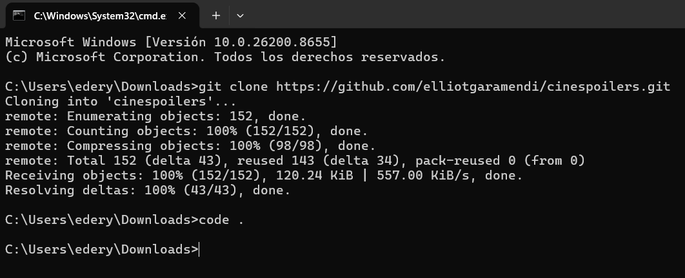
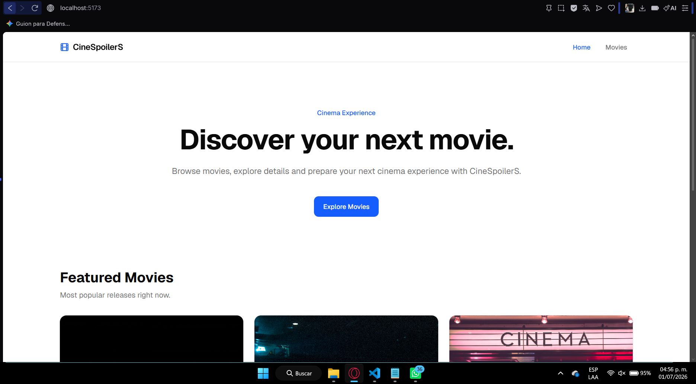
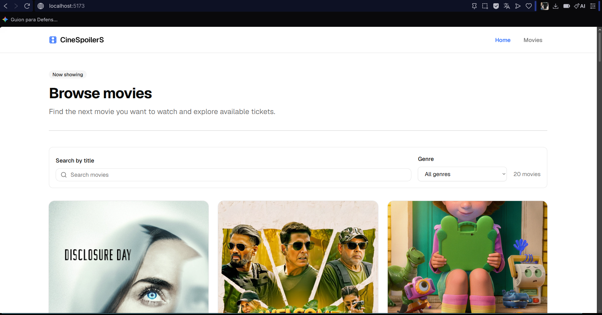
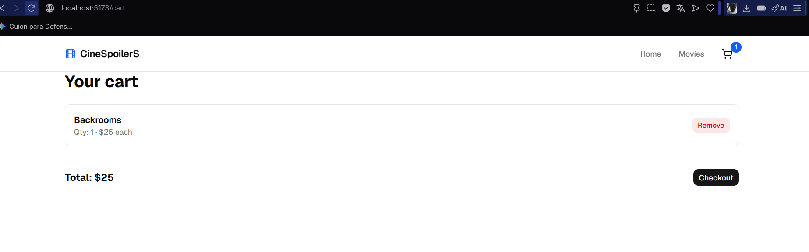
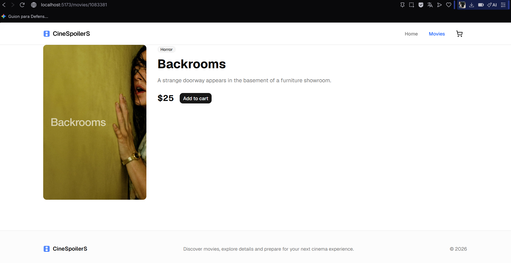
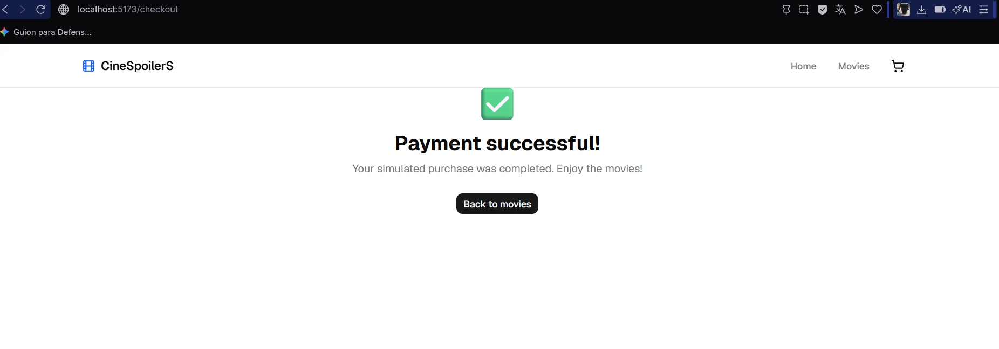
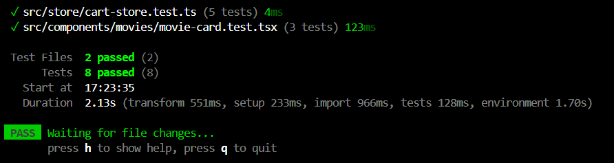

Buena idea, dejamos todo documentado en un solo README bien completo. Reemplaza todo el contenido de README.md por esto:
markdown# 🎬 CineSpoilers

Aplicación web para explorar películas, ver detalles y simular la compra de entradas, consumiendo datos en tiempo real de **The Movie Database (TMDB) API**.

## 👥 Integrantes

- Ederd Carrasco
- Analí Salvador Advincula

## 🚀 Tecnologías

- React 19 + TypeScript
- Vite
- TailwindCSS
- React Router
- TanStack Query (React Query)
- Zustand (estado global)
- Axios
- Vitest + Testing Library (tests unitarios)

## ✨ Funcionalidades

- Consumo de la API de TMDB (películas populares y detalle por ID)
- Búsqueda de películas por título y filtro por género
- Carrito de compras con estado global (Zustand)
- Página de detalle de película
- Simulación de pasarela de pago
- Tests unitarios del carrito y de componentes

## ⚙️ Instalación y ejecución local

### 1. Clonar el repositorio

```bash
git clone https://github.com/eder3105/cinespoilers.git
cd cinespoilers
```

### 2. Instalar dependencias

```bash
npm install
```

### 3. Configurar variables de entorno

Crea un archivo `.env` en la raíz del proyecto con:
VITE_API_URL=https://api.themoviedb.org/3
VITE_API_TOKEN=tu_token_de_tmdb_aqui

Puedes obtener tu propio token gratis en [themoviedb.org/settings/api](https://www.themoviedb.org/settings/api) (necesitas el **API Read Access Token**, no el API Key clásico).

### 4. Levantar el proyecto

```bash
npm run dev
```

Abre [http://localhost:5173](http://localhost:5173)

### 5. Correr los tests

```bash
npm run test
```

## 🗂️ Estructura del proyecto
src/
├── components/
│   ├── home/          # Componentes de la landing (hero, etc.)
│   ├── layout/         # Navbar, footer, contenedor de página
│   ├── movies/         # Card, grid, lista, búsqueda de películas
│   └── ui/              # Componentes base (shadcn/ui)
├── pages/
│   ├── home-page.tsx
│   ├── movies-page.tsx
│   ├── movie-detail-page.tsx
│   ├── cart-page.tsx
│   └── checkout-page.tsx
├── services/
│   ├── http-client.ts   # Cliente axios configurado con la URL y token de TMDB
│   └── tmdb-service.ts  # Funciones para consumir el API de TMDB
├── store/
│   └── cart-store.ts    # Estado global del carrito (Zustand)
├── types/
│   └── movie.ts          # Tipo Movie usado en toda la app
└── routes/
└── router.tsx         # Definición de rutas

## 📋 Checklist del proyecto

- [x] Clonar repositorio
- [x] Levantar proyecto
- [x] Consumir data de TMDB
- [x] Implementar estado global (Zustand)
- [x] Desarrollar todas las pages
- [x] Agregar pasarela de pagos de película comprada (Simulación)
- [x] Agregar tests al proyecto

## 🛒 Flujo de la app

1. **Home** → muestra películas destacadas (populares en TMDB)
2. **Movies** → catálogo completo con búsqueda por título y filtro por género
3. **Movie Detail** → detalle de la película, con botón "Add to cart"
4. **Cart** → resumen del carrito con opción de eliminar ítems y total
5. **Checkout** → formulario de pago simulado (no procesa pagos reales) → confirmación de compra

## 📸 Evidencias

### Ederd Carrasco









### Analí Salvador

<!-- Analí agrega aquí sus capturas, ej: docs/anali-1.png -->